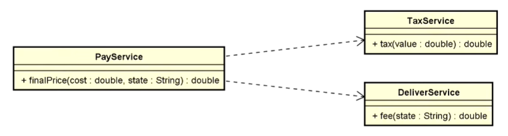

# Injação de dependência no Spring

## Tópicos:

- Sistema e componentes
- Solução java "vanilla"
- Solução Spring Boot
  - @Component, @Service, @Autowired
  - Construtor vs. @Autowired
  - Padrão de projeto Singleton
- **SRP** (_single-responsibility principle_)
- **OCP** (_Open/Closed Principle_)
- **IoC** _(Inversion of Control)_
- **DI** _(Dependency Injection)_

### Princípios SOLID aplicados:

> **SRP** o princípio de responsabilidade única, cada classe deve ter responsabilidade sobre uma única parte da funcionalidade e deve ser encapsulada.

> **OCP** o código deve ser aberto para extensão, mas fechado para alteração.

> **IOC e DI** _Inversão de dependência_ é a inversão de controle por **meio** da injeção de dependência.

## Problema proposto:

Fazer um programa para calcular o preço final de um produto, dado seu custo e o local de entrega.

### Regras:

- Imposto: 10%
- Taxa de entrega:
  - R$ 10,00 para o estado de SP
  - R$ 20,00 para os outros estados

### Exemplo:

**Custo:** 300,00 \
**Local de entrega:** SC \
**Resultado:** 350,00

## UML - Pay Service

  

